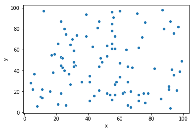
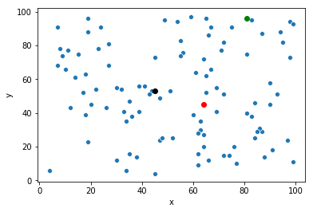
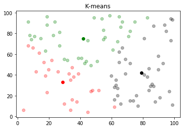
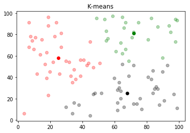

# K means clustering Algorithm

## Generating random data
with 2 features and 100 random points
```python
df.shape

## output
(100, 2)
````
### Plotting data



### Pick Random centers

```python
k = 3 ## set number of clusters to be 3

plt.scatter(df.x, df.y, color=df.color, alpha=0.3)
plot_centers(C)
plt.show()
```


### Calculating distance
**Ecludian distance** between each point and the center

```python
plot_k_means(df, C, 'Random Centers')
```


### Updating Centers

```python

def update_centers(Centers):
    C_old = Centers.copy()
    for i, c in enumerate(Centers.keys()):
        Centers[c] = list(df[df.cluster == i+1][['x', 'y']].mean().apply(int).values)
    return Centers, C_old

```

## 1st iteration


## 15ths iteration



[code](https://github.com/Marwan-Mostafa7/Master_ML/blob/master/K%20means.ipynb)
